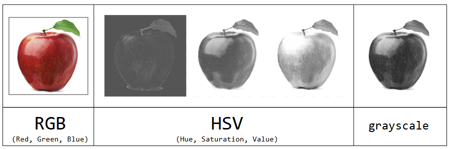

# Applied ML project: Fruits & Vegetable Classifier



## Description
This project implements a CNN that classifies fruits and vegetables and an SVM that is used as a baseline model. This project trains 3 CNNs, which are trained on three color spaces (RGB, HSV, and greyscale). 

The CNN models are deployed using FastAPI, which allows users to upload an RGB image and receive predictions from all three models.


## Installation Dependencies

1. Clone the repository

```bash
    git clone git@github.com:Jadwiga-beep/AppliedML_project.git
    cd AppliedML_project
```

2. Create a virtual environment and install dependencies

```bash
    uv sync
```

3. Activate the virtual environment

```bash
    source .venv/bin/activate
```

## Launch API

Before running the API, run `models.py` so the trained models are saved to disk.

1. Train and save the models

```bash
    python models.py
```

2. Start the API server

```bash
    uvicorn main:app --reload
```


## Using the API

### Running the API through the Browser

Open the interactive docs and use the `/predict` endpoint to upload an image directly:

```
    http://127.0.0.1:8000/docs
```

### Using `check.sh`

`check.sh` is a bash script that takes an image URL and first downloads it, then sends it to the API, and prints the result. It additionally uses `|jq` to make the print more readable which can be installed with `sudo apt install jq` if needed. Make it executable once:

```bash
chmod +x check.sh
```

Then pass it an image URL in quotations:

```bash
./check.sh "https://hsph.harvard.edu/wp-content/uploads/2024/06/potatoes-1200x800-1.jpg"
```

To send a local image file to the API yourself:

```bash
curl -X POST http://127.0.0.1:8000/predict -F "file=@path/to/image.jpg"
```